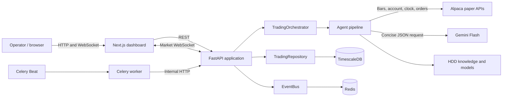
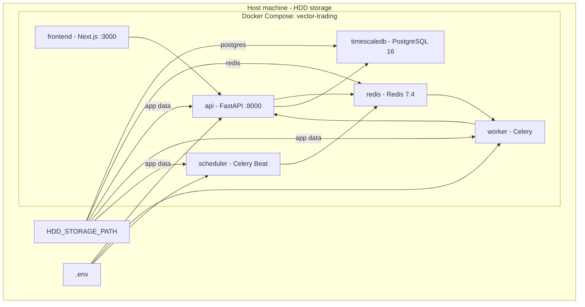
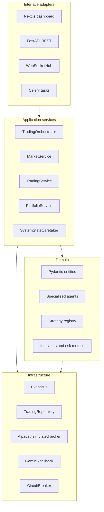
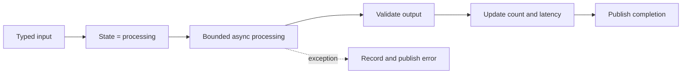
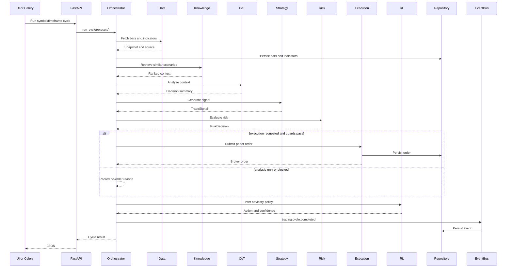
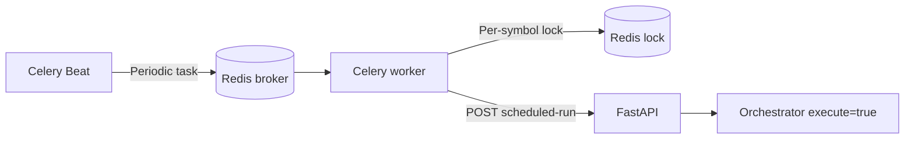
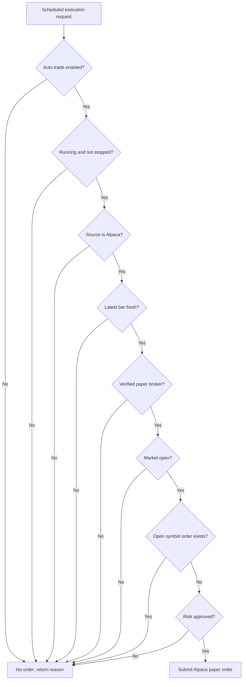

# Vector Trading System Architecture

## 1. Scope

Vector is a multi-agent, paper-only trading system for 1-60 minute market intervals. It combines deterministic strategies, risk controls, Alpaca paper execution, Gemini Flash summaries, market-scenario retrieval, reinforcement learning, scheduled jobs, durable storage, and a real-time dashboard.

It targets a controlled single-machine demo/project deployment using Docker Compose and HDD-backed persistence. Live Alpaca endpoints are rejected. Enabling auto trade permits scheduled **paper** orders only after all strategy, risk, provenance, freshness, market-hours, duplicate-order, and broker checks pass.

## 2. Architectural goals

- Keep domain and agent logic independent of FastAPI, Celery, Docker, and vendor SDKs.
- Separate continuous analysis from explicitly enabled execution.
- Preserve market data, events, orders, knowledge, learned weights, and safety state across restarts.
- Bound failures using validation, timeouts, circuit breakers, task retries, and distributed locks.
- Limit storage growth and write amplification for HDD operation.
- Expose runtime state through REST, WebSocket, health checks, logs, and the dashboard.

## 3. System context



Alpaca, Gemini, and the browser are external trust boundaries. Alpaca credentials are accepted only with a paper API URL. Gemini receives a bounded market-analysis payload and returns a concise JSON decision summary; private model chain-of-thought is neither requested nor persisted.

## 4. Deployment architecture



The frontend and API bind to `127.0.0.1:3000` and `127.0.0.1:8000`. Redis and TimescaleDB remain internal. Health dependencies start storage before the API and the API before worker-facing services. Containers use `restart: unless-stopped` and resource limits.

The API owns the single in-memory orchestrator. Workers call it through the internal API instead of creating separate orchestrators. This prevents auto-trade, emergency-stop, cycle-count, and strategy state from diverging between processes.

## 5. Layered component model



### Responsibilities

- `frontend/app/page.tsx` renders equity, performance, positions, market data, persistence counts, orchestrator state, and agent health.
- `backend/api/main.py` is the composition root for adapters, agents, services, event subscriptions, and lifecycle resources.
- `backend/api/websocket.py` manages real-time browser channels.
- `backend/tasks/celery.py` defines periodic cycles and reconciliation.
- `TradingOrchestrator` coordinates decisions, execution gates, learning, reconciliation, emergency stop, resume, and durable state.
- `MarketService`, `TradingService`, and `PortfolioService` expose focused use cases.
- `SystemStateCaretaker` atomically stores and restores a `SystemMemento`.

Pydantic models provide validated messages: `MarketBar`, `MarketSnapshot`, `TradeSignal`, `RiskDecision`, `Order`, `Position`, `Portfolio`, `AgentStatus`, and `AgentEvent`. Enums constrain actions, order types, regimes, sources, and states.

Strategies share one interface and are resolved through `StrategyRegistry`. Implementations are momentum, mean reversion, breakout, trend following, and swing. Infrastructure adapters isolate SQLAlchemy, Redis, Alpaca, Gemini, WebSocket, and failure handling from application logic.

## 6. Agent architecture

Every agent extends `BaseAgent[I, O]`, whose Template Method controls the lifecycle:



| Agent | Responsibility | Output |
|---|---|---|
| Data | Fetch Alpaca bars, optionally generate deterministic fallback data, calculate indicators, classify regime | `MarketSnapshot` with provenance |
| Knowledge | Embed conditions and retrieve five similar scenarios through ChromaDB or JSONL fallback | Ranked scenarios |
| CoT | Request an auditable Gemini Flash summary or use deterministic fallback | Regime, strategy recommendation, confidence, summary |
| Strategy | Resolve selected/automatic strategy and create buy, sell, or hold | `TradeSignal` |
| Risk | Check confidence, buying power, exposure, daily loss, Kelly sizing, VaR, and Sharpe | `RiskDecision` |
| Execution | Submit an approved bracket-capable paper order and persist it | `Order` or no order |
| RL | Infer with optional PPO or lightweight policy-gradient weights | Advisory policy |
| Validation | Perform walk-forward evaluation | Backtest metrics |

RL output is advisory and cannot override the strategy/risk path. Learning runs after explicit feedback or when reconciliation detects a newly completed round trip. Weights use compressed NumPy storage, with optional PPO checkpoints.

## 7. Trading-cycle sequence



Agents execute sequentially because later stages require validated earlier outputs. They exchange typed values through the orchestrator and publish lifecycle events through the bus. Redis stores a durable event copy while local subscribers receive live events.

## 8. Scheduling and automatic paper trading

Celery Beat derives schedules from `SCHEDULED_SYMBOLS`, `SCHEDULED_TIMEFRAMES`, and `CYCLE_SCHEDULE_SECONDS`. Each pair enqueues `trading.run_cycle`. A worker acquires Redis lock `vector:lock:cycle:{symbol}:{timeframe}` and calls the internal `scheduled-run` endpoint. Reconciliation runs every 60 seconds.



Turning on auto trade persists execution permission; it does not force an immediate order. A scheduled cycle submits only if a strategy returns buy/sell, risk approves it, and every gate passes.

### Execution gates



Emergency stop disables auto trade, stops the orchestrator, persists the state, and requests cancellation of open broker orders. Resume returns to analysis mode; auto trade must be enabled again.

## 9. Persistence

| Store | Data | Durability and limits |
|---|---|---|
| TimescaleDB/PostgreSQL | Bars, indicators, events, local orders | HDD volume; bars use `(time, symbol)` identity |
| Redis | Celery broker/results, locks, `vector:events` | HDD volume; event stream is approximately capped |
| JSONL / ChromaDB | Similar scenarios and outcomes | `/data/knowledge`; fallback loads the latest 5,000 records |
| NumPy / PPO | RL weights/checkpoint | `/data/models`; updated after learning |
| JSON memento | Cycles, strategy, auto trade, stop flag, learned count | Atomic `/data/state/system.json` replacement |

`TradingRepository` hides database mechanics. Local development defaults to SQLite WAL; Docker overrides `DATABASE_URL` for TimescaleDB. ORM-managed runtime tables are `market_data`, `indicator_values`, `orders`, and `agent_events`. Initialization SQL also creates Timescale hypertables and extension-ready strategy/trade tables.

Reconciliation fetches Alpaca orders, selects application-owned records with the `vector-` client prefix, updates local fills/status, persists bracket legs, recalculates performance, and triggers learning after a new closed trade.

## 10. API and real-time delivery

REST groups cover health, market quotes/history, manual paper orders, portfolio/performance/statistics, agent status/strategy/backtests, and orchestrator controls. Protected routes require `X-API-Key` when configured. WebSockets use the `api_key` query parameter because browsers cannot add arbitrary WebSocket headers.

`/ws/{channel}` accepts `market`, `orders`, `agents`, `alerts`, or `performance`. The API broadcasts configured-symbol quotes to `market`. The dashboard reconnects, polls if the stream is stale, loads history on symbol changes, and refreshes account/system state every ten seconds.

WebSocket delivery is live and in-memory. Redis Stream is durable event history, but the hub does not replay missed events after reconnection.

## 11. Design patterns and SOLID

| Pattern or principle | Implementation |
|---|---|
| Template Method | `BaseAgent.process()` owns timeout, validation, status, error, and events |
| Strategy | Algorithms implement one interface and use `StrategyRegistry` |
| Factory | `AgentFactory` constructs agents with injected dependencies |
| Observer / Pub-Sub | `EventBus` delivers topic/wildcard events and writes Redis Stream |
| Repository | `TradingRepository` isolates persistence |
| Adapter | Alpaca, simulated broker, Gemini, database, Redis, WebSocket |
| Command | Trading service encapsulates order placement/cancellation |
| Memento | `SystemMemento` restores safety state |
| Circuit Breaker | External provider failures are bounded |
| Composition Root | `backend/api/main.py` wires concrete dependencies |
| Single Responsibility | Each agent/service owns a narrow concern |
| Open/Closed | Strategies and adapters can be extended |
| Liskov Substitution | Broker/strategy implementations preserve contracts |
| Interface Segregation | Consumers use focused provider capabilities |
| Dependency Inversion | Orchestration receives its dependencies |

## 12. Reliability, safety, and security

- Non-paper Alpaca URLs are rejected.
- Synthetic data can be analyzed but never auto-traded.
- Agents have timeouts; Celery tasks have limits, retries, and backoff.
- Redis locks prevent overlapping scheduled cycles.
- Alpaca and Gemini use network timeouts and circuit breakers.
- Orders use a `vector-` client prefix for reconciliation ownership.
- Risk covers confidence, buying power, exposure, daily loss, stop distance, Kelly sizing, VaR, and Sharpe.
- Auto-trade and emergency-stop state survive restarts.
- Secrets load from ignored `.env`; tracked templates contain placeholders.
- API controls include rate limiting, CORS, security headers, and optional API-key authentication.
- `/health` checks database, Redis, disk, and memory; `/health/deep` also probes Alpaca and Gemini.

## 13. Failure and fallback behavior

| Failure | Behavior |
|---|---|
| Alpaca data unavailable | Optional deterministic synthetic data, explicit synthetic label, execution blocked |
| Alpaca broker unavailable | Order prevented; scheduled task may retry |
| Gemini unavailable | Deterministic regime fallback with provider/failure information |
| ChromaDB unavailable | JSONL and NumPy similarity fallback |
| Stable-Baselines3 unavailable | Lightweight policy-gradient fallback |
| Redis stream write fails | Local delivery continues; health degrades until reconnect |
| Database unavailable | Health degrades and persistence failures surface |
| WebSocket disconnects | Browser reconnects while REST/quote polling continues |
| Container restarts | Compose restarts services and restores HDD state |

## 14. Current boundaries

- This is production-oriented for a controlled demo, not a regulated brokerage platform.
- Automated execution is Alpaca paper-only.
- EventBus delivery is in-process; Redis Stream is durable storage, not a distributed agent consumer-group workflow.
- Agents are independent components in one API process, not separate microservices.
- RL is advisory and cannot override deterministic strategy/risk decisions.
- Performance is reconstructed from reconciled filled orders.
- Rate limits and WebSocket sessions are process-local; horizontal scaling needs shared limits and Redis-backed fan-out.
- Localhost binding assumes a trusted workstation. Internet exposure needs TLS, a reverse proxy, stronger access controls, managed secrets, and production monitoring.

## 15. Repository map

```text
trading-app/
|-- backend/
|   |-- agents/              # Base, factory, specialized agents
|   |-- api/                 # REST and WebSocket adapters
|   |-- infrastructure/      # Event bus and circuit breaker
|   |-- models/              # Domain entities and DTOs
|   |-- services/            # Orchestration and use cases
|   |-- storage/             # External and database adapters
|   |-- strategies/          # Strategies and registry
|   |-- tasks/               # Celery tasks and schedules
|   |-- tests/               # Automated tests
|   `-- utils/               # Settings, indicators, risk metrics
|-- frontend/                # Next.js dashboard
|-- infrastructure/docker/   # Images and database initialization
|-- scripts/                 # Setup, startup, backup utilities
|-- docs/                    # Architecture and audit artifacts
|-- docker-compose.yml       # Deployment topology
|-- .env.example             # Safe configuration template
`-- README.md                # Setup and operations
```

## 16. Extension guidance

To add a strategy, implement the shared interface, return a valid `TradeSignal`, register it, and add deterministic tests. To add a broker or reasoning provider, implement its focused capabilities and inject the adapter at the composition root.

To distribute agents, retain domain messages and lifecycle semantics while replacing direct calls with acknowledged Redis consumer groups or another transport. Add idempotency, dead-letter handling, replay rules, and trace propagation.

Any order-capable extension must preserve the paper-only invariant and execution-gate ordering unless the system is deliberately redesigned with separate authorization, compliance, audit, and production controls.
