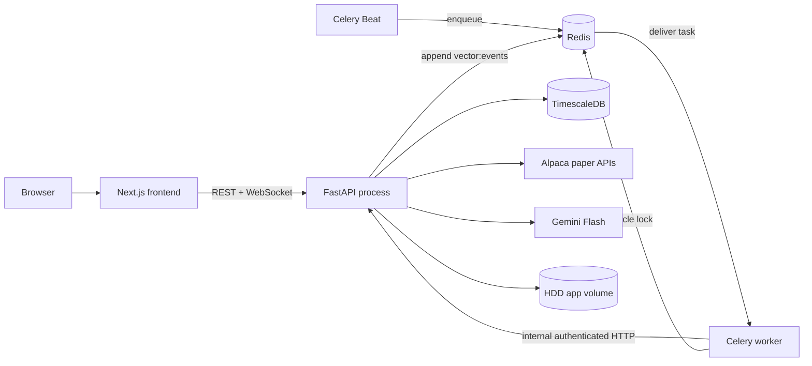
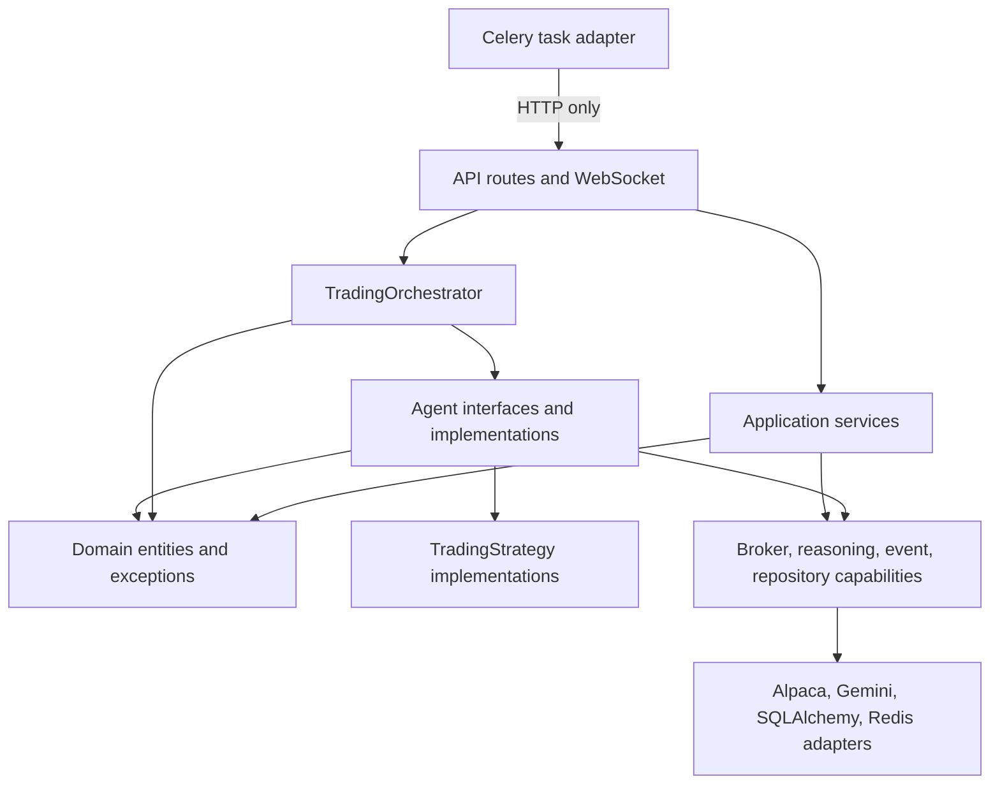
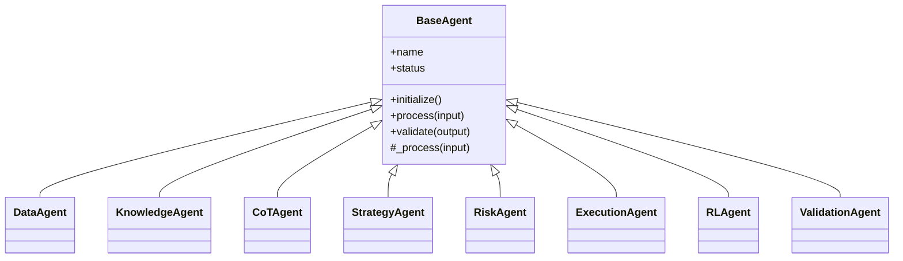
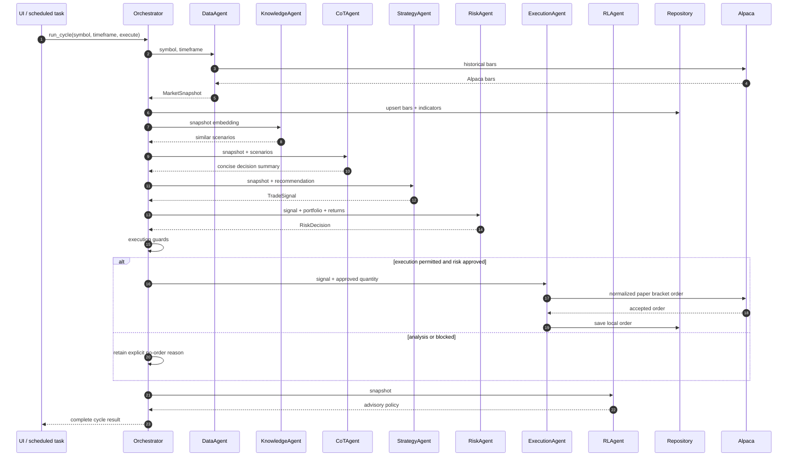
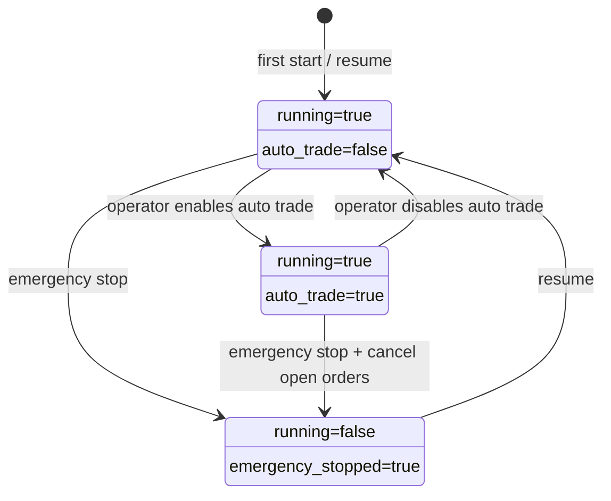
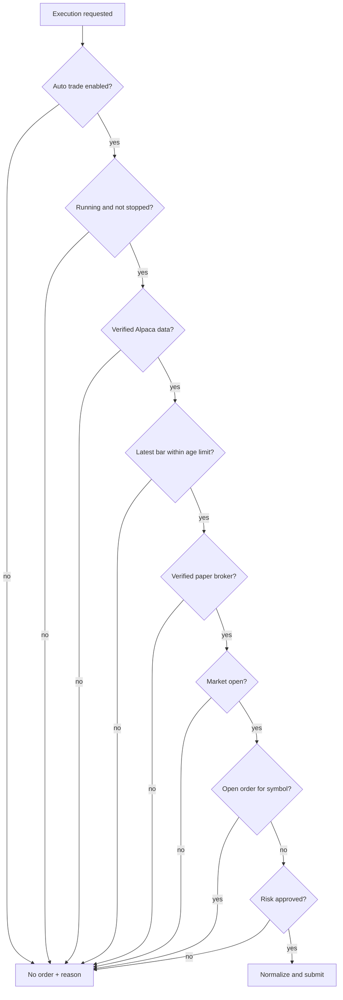
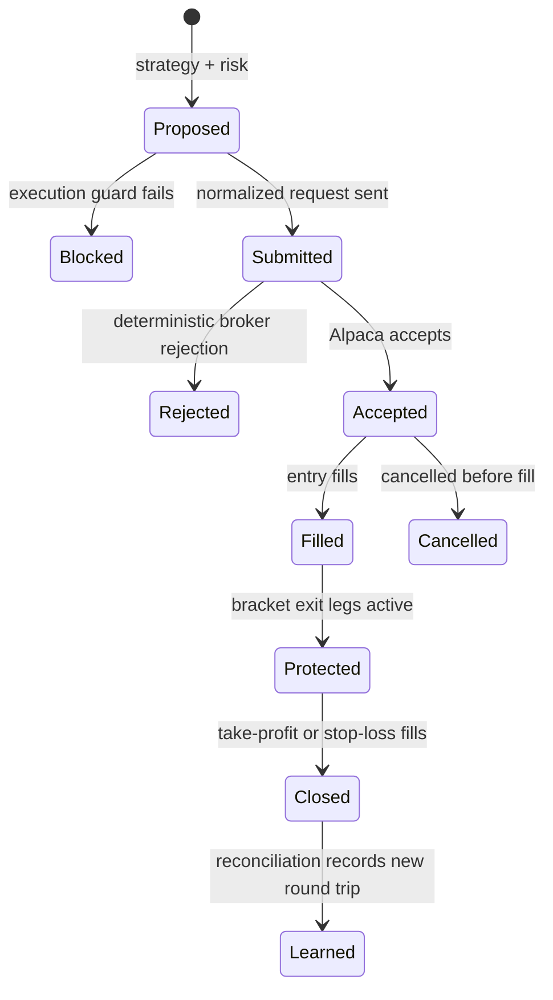
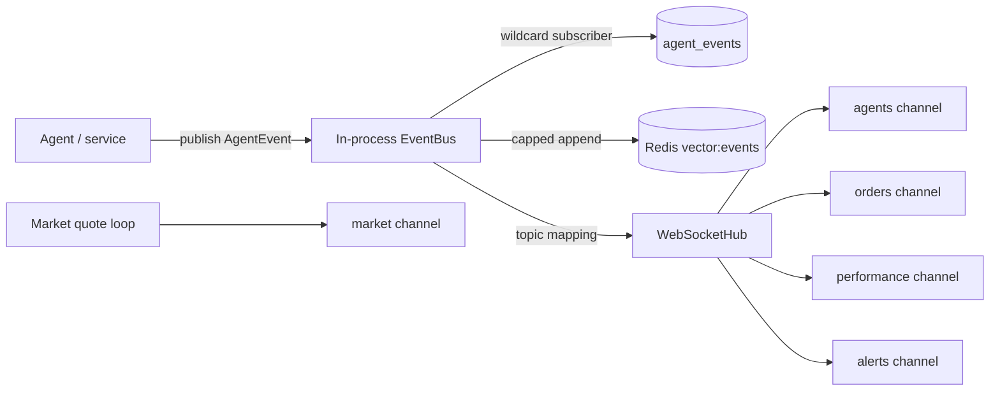
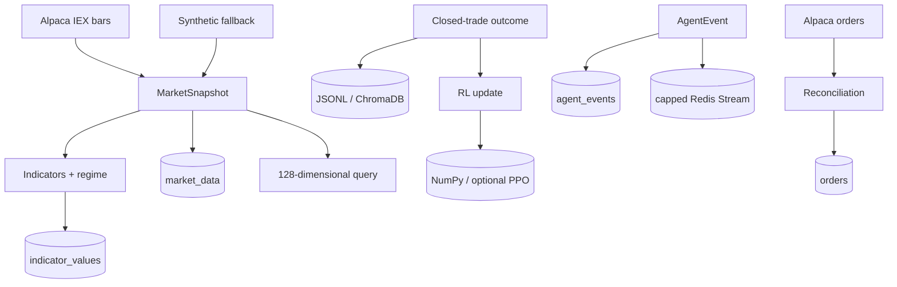

# Vector Trading System - Software Architecture

> This document explains how the system is shaped internally, why the boundaries exist, and where to change it safely. For installation, configuration, commands, UI usage, and troubleshooting, use [README.md](../README.md).

## 1. Architectural thesis

Vector is a modular monolith with background workers, not a collection of networked agent microservices. The decision agents live in one API process and are coordinated through typed domain objects. Celery provides scheduled triggers, Redis provides task transport, locking, and durable event capture, and TimescaleDB owns relational history.

This shape is deliberate:

- One process owns trading state, preventing scheduler/API disagreement.
- Agent classes stay independently testable without distributed-system overhead.
- Vendor integrations remain replaceable adapters.
- Analysis and execution are separate capabilities.
- Safety invariants are enforced at multiple boundaries, not only in the UI.

## 2. Runtime ownership

| Runtime | Owns | Must not own |
|---|---|---|
| Next.js frontend | Presentation state, polling, WebSocket connection, operator intent | Trading decisions or authoritative safety state |
| FastAPI process | Composition root, orchestrator, agents, live WebSocket hub, API policy | Scheduling cadence |
| Celery Beat | When cycles and reconciliation become due | Agent instances or trading state |
| Celery worker | Redis locks and authenticated calls to the API | A second orchestrator |
| TimescaleDB | Bars, indicators, events, locally known orders | Live broker truth |
| Redis | Celery messages/results, cycle locks, capped event stream | Authoritative portfolio state |
| Alpaca paper API | Account, positions, order acceptance, fills, market clock | Strategy selection |
| HDD application volume | Memento, knowledge records, RL policies | Source code or secrets |

The broker is authoritative for account equity, open positions, order status, and fills. The database is the application's durable observation of that broker state.

## 3. Container and process topology

A scheduled job crosses the worker/API boundary by HTTP because the API process is the only owner of the orchestrator. Running agents directly inside worker processes would create separate copies of auto-trade, emergency-stop, cycle, and strategy state.

## 4. Internal dependency direction

The concrete wiring happens once in `backend/api/main.py`. High-level orchestration receives its dependencies through constructors. Business decisions do not import FastAPI or Celery.

## 5. Core domain contracts

These objects are the stable language between components:

| Contract | Meaning | Important invariant |
|---|---|---|
| `MarketBar` | One OHLCV observation | Symbol is normalized and timestamped |
| `MarketSnapshot` | Bars plus indicators, regime, timeframe, and provenance | Timeframe is 1-60 minutes; source is explicit |
| `TradeSignal` | Strategy intent | Action, confidence, entry, stop, and target travel together |
| `RiskDecision` | Approval and safe size | Execution may not invent a quantity |
| `Order` | Local order representation | Quantity is positive; broker ID is added after acceptance |
| `Portfolio` | Broker-derived account view | Broker remains authoritative |
| `AgentEvent` | Observable lifecycle message | Includes source, topic, timestamp, correlation ID |
| `OrderRejectedError` | Deterministic broker refusal | Must not be treated as provider downtime |

Pydantic validation forms the boundary around external or computed values. Domain contracts are intentionally vendor-neutral; Alpaca wire constraints are applied only in the Alpaca adapter.

## 6. Agent execution model

`BaseAgent.process()` is the Template Method. It owns timeout enforcement, state transitions, validation, latency/counter updates, completion events, and error events. Subclasses own only their decision-specific `_process()`.

Agents are independent components, but the trading pipeline is intentionally sequential because each stage consumes a validated result from the previous stage. Redis events provide observation and durability; they are not currently the command path between agents.

## 7. Decision pipeline

### Stage contracts and authority

1. **Data** establishes provenance. Synthetic data may be analyzed but cannot be traded.
2. **Knowledge** retrieves context. It cannot generate or authorize orders.
3. **CoT** produces an auditable summary and strategy recommendation. It cannot size positions.
4. **Strategy** produces intent. It cannot approve its own risk.
5. **Risk** decides approval and maximum quantity. It cannot talk to Alpaca.
6. **Execution** translates an approved domain order into Alpaca's paper-order format.
7. **RL** observes and learns but is advisory; it cannot override Strategy or Risk.
8. **Validation** is invoked for backtests, outside the live order path.

This separation prevents a model response, a strategy bug, or an RL policy from directly placing an order.

## 8. Operating-state machine

The state is persisted atomically in `state/system.json`. Resume deliberately returns to analysis mode, so an emergency stop can never silently re-enable execution. A normal container restart restores the last state, including auto trade, unless the system was emergency-stopped.

## 9. Execution invariants

The orchestrator evaluates these invariants before calling the execution agent:

The Alpaca adapter adds final wire-level invariants:

- The base URL must contain `paper-api`.
- Bracket quantities are reduced to whole shares; rounding down cannot increase calculated exposure.
- Bracket stop and take-profit prices follow Alpaca's minimum price variance.
- Every application order receives a `vector-` client ID for ownership and reconciliation.
- Deterministic Alpaca 4xx rejections become `OrderRejectedError`; they do not open the provider circuit or trigger a retry storm.
- Transient transport and 5xx failures still participate in circuit breaking and Celery retry.

## 10. Order lifecycle and reconciliation

Alpaca is the source of truth. Every minute, reconciliation:

1. fetches broker orders with nested bracket legs;
2. ignores orders without the application's `vector-` client prefix;
3. updates local broker IDs, statuses, fills, and bracket legs;
4. reconstructs closed round trips and performance;
5. invokes feedback learning once for each newly observed closed-trade count.

This makes order submission and order observation separate concerns. A successful HTTP submission is not treated as proof of a fill.

## 11. Event semantics

There are two distinct guarantees:

- **Local delivery:** current API subscribers receive an event immediately on a best-effort basis.
- **Durable observation:** the event is copied to TimescaleDB and the capped Redis Stream.

Redis Stream is not yet an agent command queue or replay source for WebSockets. Browser clients that disconnect receive fresh REST state and future events after reconnect, not missed-event replay.

Topic routing is intentionally simple: `agent.*` goes to agents, order topics go to orders, trading completion topics go to performance, and unmatched events go to alerts. Market quotes use a dedicated broadcast loop.

## 12. Data ownership and lifecycle

| Data | Authoritative owner | Retention behavior |
|---|---|---|
| Account and positions | Alpaca | Queried live |
| Historical bars | Alpaca; synthetic only as labeled fallback | Upserted by time/symbol |
| Indicators | Application | One set per fetched snapshot |
| Agent events | Application | Relational history plus capped Redis copy |
| Orders/fills | Alpaca, mirrored locally | Reconciled every minute |
| Scenario memory | KnowledgeAgent | JSONL and optional ChromaDB on HDD |
| RL policy | RLAgent | Compressed weights; optional PPO checkpoint |
| Safety state | Orchestrator memento | Atomic latest-state file |

Synthetic and Alpaca observations are never treated as equivalent: provenance travels in `MarketSnapshot` and becomes an execution invariant.

## 13. Concurrency, idempotency, and consistency

### Scheduled concurrency

Beat creates one task per configured symbol/timeframe. Before calling the API, a worker acquires:

`vector:lock:cycle:{symbol}:{timeframe}`

The lock prevents the same cycle from overlapping across workers. Different symbols may run concurrently, bounded by worker concurrency.

### Order idempotency

Each order gets a stable client ID derived from its domain UUID. Repeating observation is safe because repository order writes merge by local ID. Reconciliation filters by the client prefix before importing broker state.

A future stronger design should send the same client ID across retry attempts and query Alpaca by that ID before any resubmission when a network timeout leaves acceptance uncertain.

### Consistency model

The system is intentionally eventually consistent:

- Alpaca accepts/fills orders first.
- Local order state follows during submission and reconciliation.
- Portfolio always comes from Alpaca.
- Dashboard REST polling corrects missed WebSocket updates.
- Performance changes only after fills are mirrored locally.

## 14. Failure containment

| Failure boundary | Containment behavior | Remaining service |
|---|---|---|
| Gemini quota/outage | Deterministic regime recommendation | Analysis continues |
| ChromaDB unavailable | JSONL + NumPy similarity | Knowledge retrieval continues |
| Stable-Baselines3 unavailable | Lightweight policy-gradient policy | RL inference/learning continues |
| Alpaca history unavailable | Labeled synthetic data if enabled | Analysis only; execution blocked |
| Alpaca order 4xx | Explicit no-order reason, no retry storm | Later cycles continue |
| Alpaca/network 5xx | Timeout, circuit breaker, task retry | Failure remains observable |
| Redis stream append fails | Local delivery continues; health degrades | API can still process current event |
| WebSocket disconnect | Dead socket removed; browser reconnects and polls | Trading is unaffected |
| Database failure | Health degrades; durable operations fail visibly | No false persistence success |
| Emergency stop | Auto trade disabled and open orders cancelled | Analysis resumes only after operator action |

Failure handling favors safe non-execution. Fallback reasoning or data can never silently weaken the execution gates.

## 15. Architectural decisions

### ADR-001: Modular monolith before agent microservices

**Decision:** Keep agents in one API process.

**Reason:** The pipeline is dependency-ordered, throughput is low, and one owner for safety state is more valuable than independent deployment.

**Trade-off:** Agent scaling and failure isolation are process-level rather than service-level.

### ADR-002: API-owned orchestration

**Decision:** Workers trigger the orchestrator through internal HTTP.

**Reason:** Importing API globals into Celery would create another object graph and contradictory state.

**Trade-off:** Scheduled cycles depend on API availability.

### ADR-003: Paper-only broker invariant

**Decision:** Reject non-paper Alpaca URLs in the adapter.

**Reason:** A configuration mistake must not convert a demo system into live trading.

**Trade-off:** Live deployment requires deliberate architectural and authorization work, not a flag change.

### ADR-004: Deterministic strategy/risk execution path

**Decision:** Gemini recommends a strategy and RL remains advisory.

**Reason:** Model output should not directly authorize broker actions.

**Trade-off:** Learning cannot autonomously replace deterministic policy.

### ADR-005: Broker truth with local reconciliation

**Decision:** Read portfolio from Alpaca and mirror fills locally.

**Reason:** Local submission state cannot prove exchange simulation outcomes.

**Trade-off:** UI performance metrics lag until reconciliation.

### ADR-006: Dual event persistence

**Decision:** Use relational event history plus a capped Redis Stream.

**Reason:** SQL supports audit queries; Redis supports inexpensive recent operational inspection.

**Trade-off:** They are duplicate observations and not a transactional outbox.

## 16. Safe extension points

### Add a strategy

Implement `TradingStrategy.generate(snapshot)`, return a valid `TradeSignal`, register it, and add deterministic tests. Do not add broker access to a strategy.

### Add a broker

Implement history, portfolio, clock, submit/cancel, list, and health capabilities. Preserve provenance, idempotency, explicit rejection types, and the paper-only boundary unless a separately governed system is designed.

### Distribute agents

Replace direct stage calls with acknowledged messages only if independent scaling is justified. The distributed design would also require:

- idempotency keys per stage;
- schema versioning;
- consumer groups and dead-letter queues;
- correlation/trace propagation;
- replay rules;
- ordering guarantees;
- centralized safety-state ownership.

### Scale the API

Before running multiple API replicas, move rate limiting and WebSocket fan-out to shared infrastructure and make orchestrator state transactional or single-leader. The current in-memory hub and orchestrator intentionally assume one API replica.

## 17. Technical debt and next architectural work

1. Add a transactional outbox so database state and event publication cannot diverge.
2. Store explicit cycle records, including no-order reasons, instead of reconstructing them from events.
3. Add broker-order lookup by client ID before retrying uncertain submissions.
4. Add Redis-backed WebSocket fan-out and replay cursors if horizontal scaling is needed.
5. Add retention/compression policies for Timescale hypertables.
6. Persist richer RL training metadata and model version lineage.
7. Separate provider quota state from generic agent health in the UI.
8. Run containers as non-root after defining HDD volume ownership.
9. Add end-to-end contract tests against an isolated Alpaca paper account.
10. Add OpenTelemetry traces using the existing event correlation ID.

These are evolution points, not hidden claims about current behavior. The diagrams and decisions above describe the implementation as it exists now.
